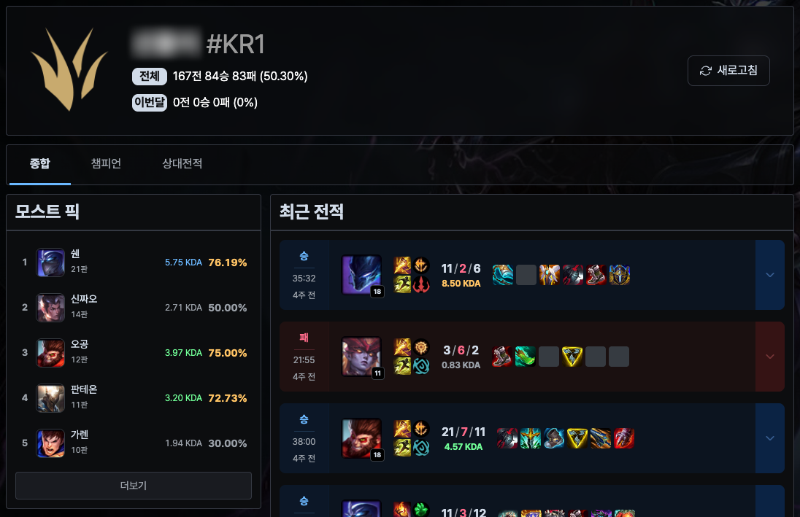
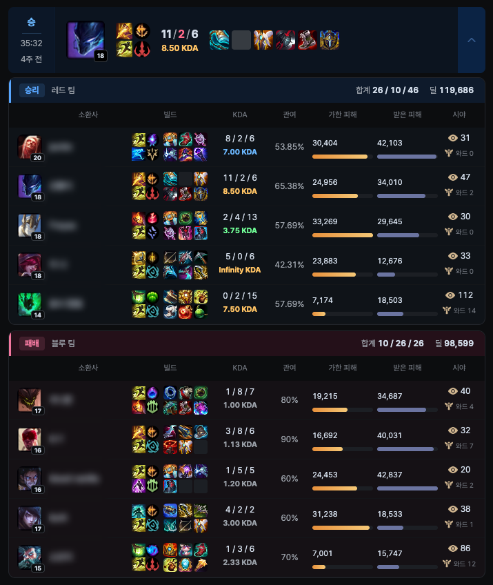
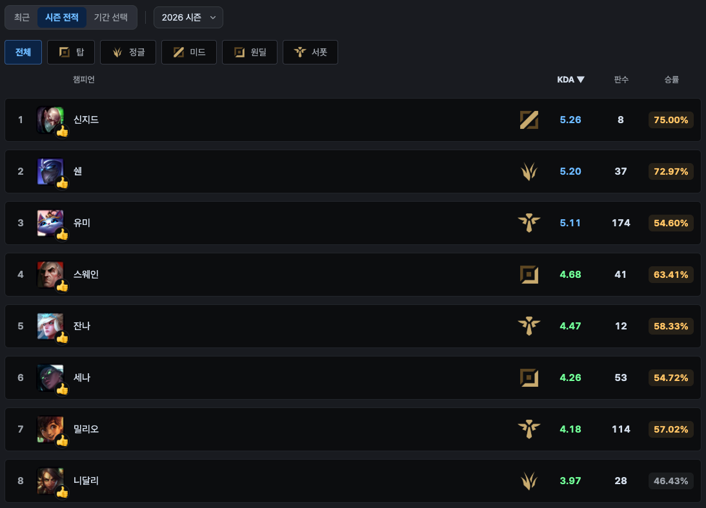
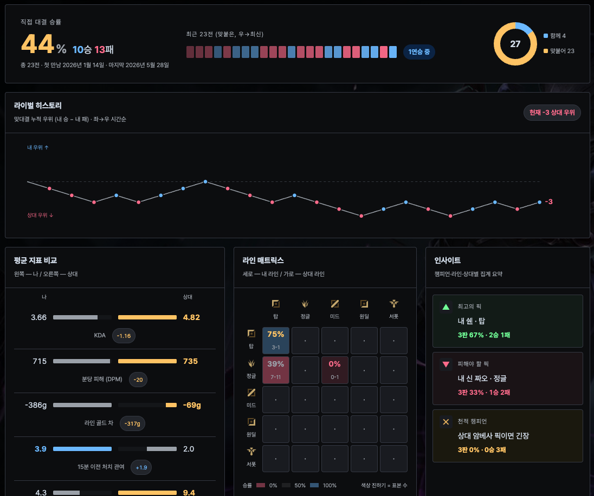

<div align="center">
  

  <p>리그 오브 레전드 <b>내전 전적</b> 서비스의 프론트엔드</p>

  <a href="https://gmok.kr">gmok.kr</a>
</div>

---

일반 전적 사이트와 달리 솔로랭크·일반 게임은 다루지 않습니다. 클랜원이 직접 치른 내전의
리플레이(`.rofl`) 파일을 업로드하면 그 경기만 파싱되어, 디스코드 서버(클랜) 단위로 전적·통계·
랭킹이 쌓입니다.



## 주요 기능

| | |
|---|---|
| **경기 상세** | 10인 스코어보드를 아이템·룬·스펠까지. KDA, 킬 관여율, 가한/받은 피해, 시야 점수 |
| **챔피언 통계** | 챔피언별 판수·승률·KDA. 포지션 필터와 기간 필터(최근·시즌·월 범위) |
| **상대전적 (H2H)** | 맞대결 승률, 라인 매치업, 듀오 조합 승률, 연승·연패 흐름 |
| **클랜 랭킹** | 클랜 전체 단위의 챔피언·유저 랭킹. 부계정은 본계정에 합산 |
| **대회** | 대회 생성, 팀 편성, 신청·승인, 경기 배정, 순위표 |
| **클랜 관리** | 업로드 권한, 클랜원 상태, 부계정 연결 |

### 경기 상세

10인 스코어보드를 빌드·KDA·관여율·가한/받은 피해·시야까지 그대로 펼쳐 봅니다.



### 챔피언 통계

포지션과 기간으로 좁혀 판수·승률·KDA를 정렬합니다.



### 상대전적 (H2H)

특정 상대와의 누적 우위, 라인 매치업, 평균 지표 비교, 연승·연패 흐름을 봅니다.



## 시작하기

### 요구 사항

- Node.js 18.18 이상 — `@typescript-eslint`와 husky가 요구합니다
- 백엔드 API 서버 — 로그인과 데이터 조회 모두 백엔드가 필요합니다

### 설치와 실행

```bash
npm install
npm run dev             # http://localhost:3000
```

### 환경 변수

`.env`에 다음 세 개가 필요합니다.

| 키 | 설명 |
|---|---|
| `NEXT_PUBLIC_API_BASE_URL` | 백엔드 API 주소. 인증 쿠키를 주고받으므로 CORS 허용 목록에 프론트 주소가 등록돼 있어야 합니다 |
| `NEXT_PUBLIC_DDRAGON_VERSION` | 챔피언·아이템 이미지를 받아올 Data Dragon 버전. 최신 버전은 [versions.json](https://ddragon.leagueoflegends.com/api/versions.json)에서 확인합니다 |
| `NEXT_PUBLIC_SITE_URL` | 메타 태그의 정규 주소 |

## 스크립트

```bash
npm run dev      # 개발 서버
npm run build    # 프로덕션 빌드
npm start        # 빌드 결과 실행
npm run lint     # ESLint
npm run format   # Prettier
```

커밋 시 husky pre-commit 훅이 `npm run build && npm run lint`를 실행합니다. 타입 오류나 lint
오류가 있으면 커밋이 막힙니다.

## 기술 스택

- **Next.js 12** (Pages Router) · **React 18** · TypeScript
- **TanStack Query v5** + **axios**
- **Tailwind CSS** — 색상 토큰은 `src/styles/colors.js` 한 곳에서 관리합니다

## 구조

```
src/
├── components/   # 범용 UI (layout, form, modal, ui)
├── features/     # 도메인 단위 컴포넌트
├── pages/        # 라우트
├── services/     # API 레이어
├── hooks/        # React Query 훅
├── data/types/   # 타입 정의
├── utils/        # 유틸리티
└── styles/       # 전역 CSS, 색상 팔레트
```

### API 레이어

`src/services/apiService.ts`가 axios를 감싸고 이 앱의 규약만 담당합니다.

- **인증**: 백엔드가 심는 `session_uid` 쿠키. `withCredentials`로 실려 갑니다
- **실패는 예외**: `ApiError`를 던지며 `status`와 백엔드 Problem Details의 `type`을 함께 싣습니다.
  읽기는 React Query의 `isError`로, 쓰기는 `useMutation`의 `onError`나 `try/catch`로 받습니다
- **응답 봉투**: 백엔드가 `{ status, message, data }`로 감싸 주는 것을 `unwrap()`이 벗겨,
  서비스 함수는 페이로드를 그대로 반환합니다

```ts
// src/services/champion.ts
export const getChampions = async (): Promise<ChampionItem[]> => {
  return unwrap(api.get<ChampionListResponse>("/api/champions"));
};
```

## 라우트

| 경로 | 설명 |
|---|---|
| `/` | 검색 및 서비스 안내 |
| `/summoners/[riotName]` | 동명이인 목록 |
| `/summoners/[riotName]/[riotTag]` | 소환사 상세 (종합·챔피언·상대전적·대회) |
| `/champion`, `/user` | 클랜 랭킹 |
| `/replay` | 리플레이 업로드 |
| `/competitions` | 대회 목록·상세·신청·팀 편성 |
| `/clan/*` | 클랜 관리 (업로드 권한·클랜원·부계정) |
| `/about`, `/guide`, `/faq` | 서비스 소개, 이용 가이드, FAQ |

